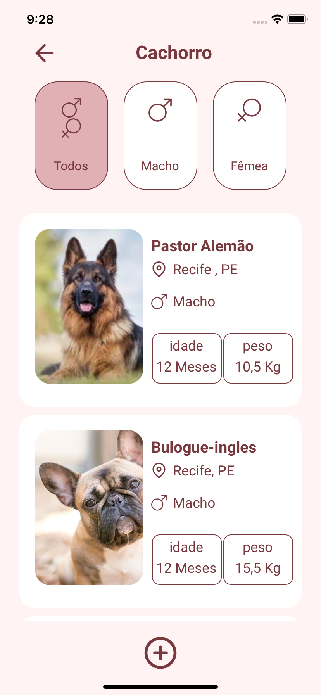
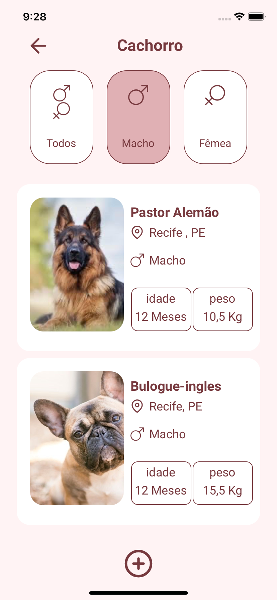
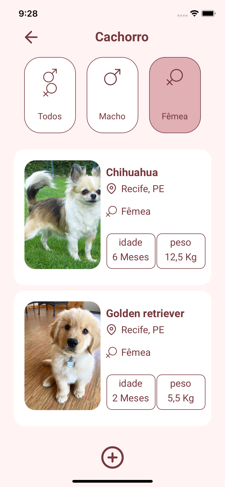
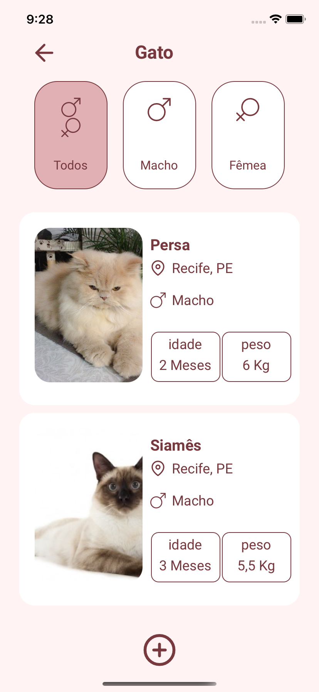

# Indice

- [Sobre](#-sobre)
- [Tecnologias Utilizadas](#-tecnologias-utilizadas)
- [Como baixar o projeto](#-como-baixar-o-projeto)


## ☀️ Sobre

A adoção de animais de estimação é o processo de assumir a responsabilidade por um animal de estimação que um proprietário anterior abandonou ou liberou para uma organização de abrigo ou resgate.  
Para ver a Api Do APP , clique aqui: [PET ADOPTION API .](https://github.com/wagneer-nasc/petadption-api)
 
<h1 align="center">
     
      
       
       
       
       
        
</h1>

 
## 💻 Tecnologias utilizadas

- [React Native](https://reactnative.dev/)
- [Typescript](https://www.typescriptlang.org/)
- [Styled Components](https://styled-components.com) 
- [Axios](https://github.com/axios/axios) 
- [Modalize](https://github.com/jeremybarbet/react-native-modalize)
- [Image-picker](https://github.com/react-native-image-picker/react-native-image-picker)
 
 ---
 ## 📁 Como baixar o projeto

```bash
# clonar repositório
$ git clone https://github.com/wagneer-nasc/pet-adoption-mobile.git

# Entrar no diretório
$ cd pet-adoption-mobile

# Instalar as dependencias
$ yarn install

# inicar o projeto
$ yarn ios para quem está com o emulador IOS
$ yarn run android para quem está com emulador Android


```
### 😁   Contato , Dúvidas , Qualquer coisa , chama :/ 
- Linkedin [Wagner Nascimento](https://www.linkedin.com/in/wagner-nascimento-8824b717b/)